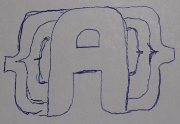

<center></center>
<center>Aura - Feel your surroundings</center>

____

Aura is a project to provide a modular and expandable programming language with emphasis on development experience.  
To provide that the language is split into multiple layers to provide faster development.

 * Language layer - Handles the parsing, lexing and interpretation to a bytecode for translation.
 * Translator layer - Translates the bytecode from the language layer and generates an executable.
 * Development layer - Interfaces for tooling and other things.


```
namespace Aura.Language

enum Visibility(u2):
    Public = 0
    Protected = 1
    Private = 2
    Local = Private


local... $T:
    $T.#visibility = Visibility.Private
    return $T

#TestLocal():
    local x = "Hello World"
    assert x.#visibility = Visibility.Private


```


```
# monsters.lib.aura

name = "Monsters"
description = `A library with all monsters

import:
    Monster = game/objects/monster

loaders:
    *.monster.aura = Monster.Loader
